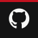
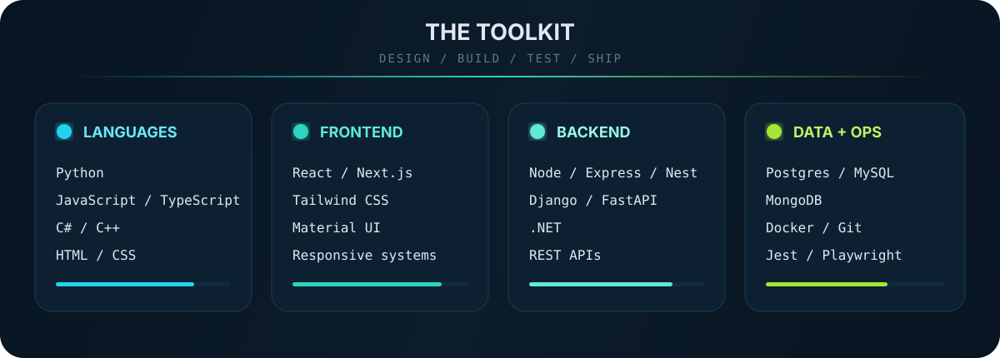
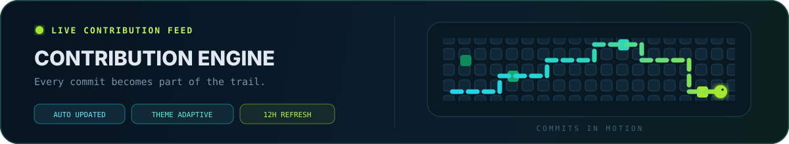

  
   
  
  &nbsp;
  
  &nbsp;
  
  &nbsp;
  
  &nbsp;
  
  &nbsp;
  

 

 

 

 

<picture>
  <source media="(prefers-color-scheme: dark)" srcset="./assets/snake/github-contribution-grid-snake-dark.svg"/>
  <source media="(prefers-color-scheme: light)" srcset="./assets/snake/github-contribution-grid-snake.svg"/>
  
</picture>

 

<em>design thoughtfully · build reliably · keep shipping</em>

