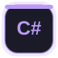
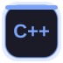

  

  

### 💫 About Me

 

 

 

 

 

<h3 align="center">🔗 Connect with me</h3>

  
  
  
  

 

<h3 align="center">💻 Languages</h3>

  
  
  
  
  
  
  

 

<h3 align="center">🛠️ Tools & Frameworks</h3>

  
  
  
  
  
  
  
  
  
  
  
  
  
  
  
  
  
  
  
  
  
  
  

  
  
  

 

  <picture>
    <source media="(prefers-color-scheme: dark)" srcset="./assets/snake/github-contribution-grid-snake-dark.svg"/>
    <source media="(prefers-color-scheme: light)" srcset="./assets/snake/github-contribution-grid-snake.svg"/>
    
  </picture>

